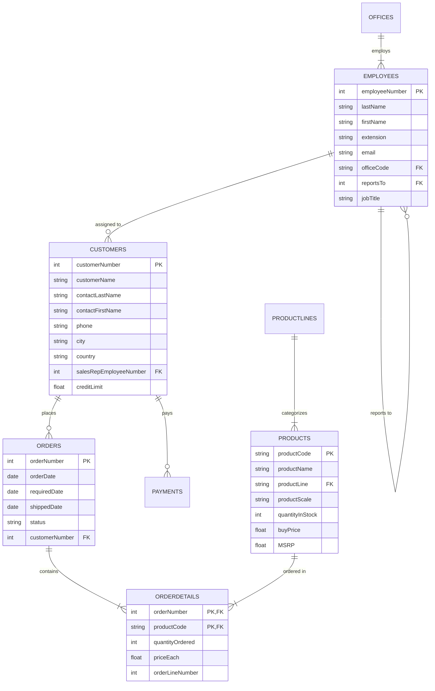

# 🏛️ SQL Analysis & Advanced Revenue Intelligence (ClassicModels DB)
### *Enterprise SQL Analytics, Relational Modeling, Window Functions & CTEs on the ClassicModels Database*

[](https://en.wikipedia.org/wiki/SQL)
[](https://www.mysql.com/)
[]()
[]()
[](https://opensource.org/licenses/MIT)

---

## 📌 Project Overview

This repository demonstrates enterprise-grade relational database analysis using **MySQL** on the classic multi-table **ClassicModels enterprise database**. The project covers the full spectrum of SQL data analytics—ranging from multi-table joins, aggregations, and business KPI derivation, to advanced **Common Table Expressions (CTEs)**, partitioned **Window Functions (`RANK()`, `DENSE_RANK()`, `ROW_NUMBER()`, `LAG()`)**, and **running totals**.

The objective is to translate relational transactions into commercial business intelligence: tracking customer order velocity, gross margins, shipping fulfillment SLAs, sales representative quota attainment, and month-over-month growth.

---

## 🗄️ Database Architecture & Entity Relationships

The **ClassicModels** relational schema models an international scale-model car and vehicle retailer across 8 interrelated tables:



---

## 📂 Repository Structure

```
├── Advanced_CTE_Window_Functions.sql   # Advanced CTEs, partitioned window functions & MoM growth
├── SQL+Analysis+Classic+Models sql.sql # Core operational analytics, profit margins & joins
├── Script for Classic Models.docx      # DDL and schema creation script for database setup
└── README.md                           # Comprehensive documentation & query catalog
```

---

## 🧠 Query Catalog & Analytical Breakdown

### Part 1: Advanced CTEs & Window Functions (`Advanced_CTE_Window_Functions.sql`)

#### 1. Top 3 Best-Selling Products per Product Line (`RANK()` + CTE)
*Uses a Common Table Expression to aggregate product revenue, then partitions `RANK()` by product line to isolate the top 3 commercial drivers without hardcoded subquery limits.*
```sql
WITH product_sales AS (
    SELECT
        p.productLine,
        p.productName,
        SUM(od.quantityOrdered) AS total_quantity_sold,
        SUM(od.quantityOrdered * od.priceEach) AS total_revenue
    FROM classicmodels.orderdetails od
    INNER JOIN classicmodels.products p
        ON od.productCode = p.productCode
    GROUP BY p.productLine, p.productName
),
ranked_products AS (
    SELECT
        productLine,
        productName,
        total_quantity_sold,
        total_revenue,
        RANK() OVER (
            PARTITION BY productLine
            ORDER BY total_revenue DESC
        ) AS revenue_rank
    FROM product_sales
)
SELECT *
FROM ranked_products
WHERE revenue_rank <= 3
ORDER BY productLine, revenue_rank;
```

---

#### 2. Month-over-Month (MoM) Sales Growth (`LAG()` Function)
*Extracts monthly transaction totals and uses the `LAG()` analytical window function to compare current month revenue against the preceding period to compute percentage growth.*
```sql
WITH monthly_sales AS (
    SELECT
        DATE_FORMAT(o.orderDate, '%Y-%m') AS order_month,
        SUM(od.quantityOrdered * od.priceEach) AS monthly_revenue
    FROM classicmodels.orders o
    INNER JOIN classicmodels.orderdetails od
        ON o.orderNumber = od.orderNumber
    GROUP BY DATE_FORMAT(o.orderDate, '%Y-%m')
)
SELECT
    order_month,
    monthly_revenue,
    LAG(monthly_revenue) OVER (ORDER BY order_month) AS prev_month_revenue,
    ROUND(
        (monthly_revenue - LAG(monthly_revenue) OVER (ORDER BY order_month))
        / LAG(monthly_revenue) OVER (ORDER BY order_month) * 100, 2
    ) AS mom_growth_pct
FROM monthly_sales
ORDER BY order_month;
```

---

#### 3. Cumulative Running Total Revenue (`SUM() OVER`)
*Maintains a continuous running total of historical revenue over time to track business sales momentum and cash flow.*
```sql
WITH daily_sales AS (
    SELECT
        o.orderDate,
        SUM(od.quantityOrdered * od.priceEach) AS daily_revenue
    FROM classicmodels.orders o
    INNER JOIN classicmodels.orderdetails od
        ON o.orderNumber = od.orderNumber
    GROUP BY o.orderDate
)
SELECT
    orderDate,
    daily_revenue,
    SUM(daily_revenue) OVER (ORDER BY orderDate) AS running_total_revenue
FROM daily_sales
ORDER BY orderDate;
```

---

#### 4. Top Customer Per Sales Representative (`ROW_NUMBER()` + CTE)
*Determines the single highest-value account managed by each sales representative using `ROW_NUMBER() OVER (PARTITION BY employeeNumber ORDER BY customer_revenue DESC)`.*
```sql
WITH rep_customer_sales AS (
    SELECT
        e.employeeNumber,
        e.firstName,
        e.lastName,
        c.customerNumber,
        c.customerName,
        SUM(od.quantityOrdered * od.priceEach) AS customer_revenue
    FROM classicmodels.employees e
    INNER JOIN classicmodels.customers c
        ON e.employeeNumber = c.salesRepEmployeeNumber
    INNER JOIN classicmodels.orders o
        ON c.customerNumber = o.customerNumber
    INNER JOIN classicmodels.orderdetails od
        ON o.orderNumber = od.orderNumber
    GROUP BY e.employeeNumber, e.firstName, e.lastName, c.customerNumber, c.customerName
),
ranked_customers AS (
    SELECT
        *,
        ROW_NUMBER() OVER (
            PARTITION BY employeeNumber
            ORDER BY customer_revenue DESC
        ) AS rn
    FROM rep_customer_sales
)
SELECT firstName, lastName, customerName, customer_revenue
FROM ranked_customers
WHERE rn = 1
ORDER BY customer_revenue DESC;
```

---

### Part 2: Core Operational & Financial Analytics (`SQL+Analysis+Classic+Models sql.sql`)

| Business Question | Technical Implementation | Analytical Value |
| :--- | :--- | :--- |
| **Average Basket by Country** | Multi-table `INNER JOIN` + `AVG()` grouped by Country | Identifies high-purchasing international territories |
| **Sales by Product Line** | Aggregation on `orderdetails` $\times$ `products` | Pinpoints highest-grossing product lines (e.g., Classic Cars) |
| **Top 10 Volume Products** | `SUM(quantityOrdered)` with `LIMIT 10` | Identifies inventory turn velocity and stock requirements |
| **Sales Rep Attainment** | `LEFT JOIN` on Employees $\to$ Customers $\to$ Orders | Captures representative contribution including inactive reps |
| **On-Time Delivery Rate** | `SUM(CASE WHEN shippedDate <= requiredDate THEN 1 ELSE 0 END) / COUNT(*)` | Quantifies supply chain SLA fulfillment rate |
| **Product Profit Margins** | `SUM(quantityOrdered * (priceEach - buyPrice))` | Calculates Gross Margin per SKU and revenue contribution |
| **Customer Segmentation** | CTE + `CASE WHEN` (`High >$100k`, `Medium $80k-$100k`, `Low <$50k`) | Classifies accounts for targeted retention and marketing |
| **Market Basket Co-Purchases**| Self-join on `orderdetails` (`od1.productCode <> od2.productCode`) | Uncovers cross-selling and bundling combinations |

---

## 🛠️ Key SQL Skills Demonstrated

* **Window Functions:** `RANK()`, `DENSE_RANK()`, `ROW_NUMBER()`, `LAG()`, `LEAD()`, cumulative `SUM() OVER ()`
* **Query Structuring:** Multi-level Common Table Expressions (CTEs), Subqueries, and temporary table optimization
* **Relational Joins:** `INNER JOIN`, `LEFT JOIN`, and Self-Joins (`orderdetails` $\times$ `orderdetails`)
* **Conditional Logic:** Advanced `CASE WHEN` constructs for segmentation, KPI flagging, and on-time compliance
* **Date & Time Arithmetic:** `DATE_FORMAT()`, interval comparisons (`shippedDate <= requiredDate`)

---

## 🚀 How to Run

1. **Clone the Repository:**
   ```bash
   git clone https://github.com/Vinaychauhan06/SQL-Classic-Models-Analysis.git
   cd SQL-Classic-Models-Analysis
   ```

2. **Set up the ClassicModels Database:**
   - Open MySQL Workbench, DBeaver, or terminal `mysql`.
   - Run the schema creation script from `Script for Classic Models.docx` or load the official MySQL sample ClassicModels dataset.

3. **Execute the Query Scripts:**
   - Run `SQL+Analysis+Classic+Models sql.sql` for operational and financial queries.
   - Run `Advanced_CTE_Window_Functions.sql` for CTEs and Window Functions.

---

## 👤 Author

**Vinay Chauhan**  
*Data Analyst & Business Intelligence Specialist*  
- **Email:** [Vc203132@gmail.com](mailto:Vc203132@gmail.com)  
- **GitHub:** [@Vinaychauhan06](https://github.com/Vinaychauhan06)  
- **LinkedIn:** [Vinay Chauhan](https://www.linkedin.com/)

---

## 📜 License
This project is open-source and available under the [MIT License](LICENSE).
